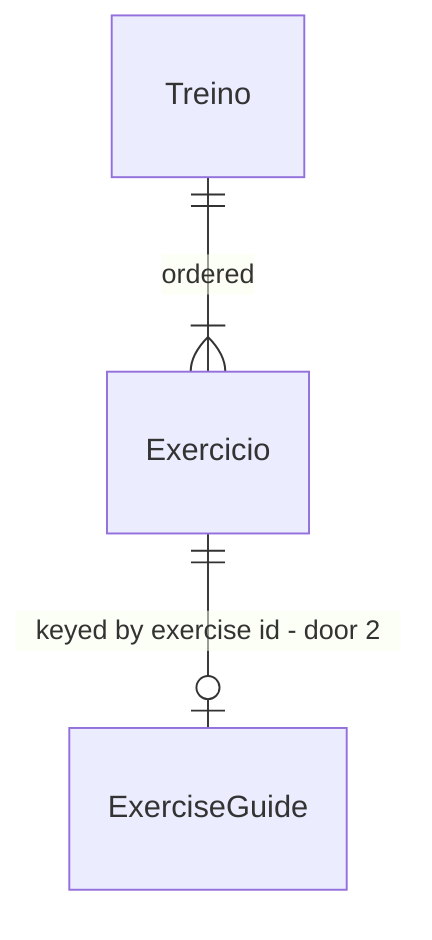

# Exercise guides ("como faz")

## Problem

She already knows how to do every exercise, because the trainer taught her. What she can't do
mid-workout is link a **name** to a **movement** ("Hack… which one was that?"). Today she googles
the name between sets or asks the trainer. Nobody has counted how often. Samuel reports it from
watching her train, and it happens with the less obvious names, not with every exercise.

When this ships, she taps an exercise's name on the Hoje checklist and sees a drawing of the
movement and one reminder line, without leaving the checklist and without a network connection.

## Flow

This reuses the static, bundled plan and its stable exercise ids (gym-app door 2) as the only key,
the existing Hoje row and its tokens, and the existing service-worker precache for offline. It adds
no storage.

1. app bundle ships `Plan` (exists) and `GUIDES` (door 1, door 2) - one guide per exercise id, compiled in, precached by the existing service worker
2. screen `Hoje` · `WorkoutCard` (exists) renders each row. A row whose exercise id has a guide gets its name as a toggle. Which guide is open is screen state in the card, reset whenever the shown workout or the day changes
3. `GuideDrawing` (new, no door - placement per conventions) - turns one `ExerciseGuide` into an inline SVG: machine shapes, start pose faded, end pose solid, one arrow per move. Colours come only from CSS classes bound to theme tokens
4. out: the expanded row (drawing, legend "começo · fim", cue line). Nothing is written to `Store` (exists)

## Impact

| Front | What changes |
| --- | --- |
| domain | new term: `ExerciseGuide` - a drawing plus one cue line for one exercise id, static content, lives in `src/domain/guides.ts` |
| domain | existing term: exercise id (`leg-press-45`) was referenced by stored weights only. Now `GUIDES` keys on it too. Renaming an id now orphans its guide as well as its weight, and the guide tests fail on it (AC 8) |
| screen `Hoje` | a row's exercise name becomes a `button` when a guide exists. Existing tests find rows by `data-testid="ex-name"` and the check by the name `Marcar <name>`. Both stay as they are |
| theme | three new tokens in `src/index.css`, in both the light and the dark block: `--fig`, `--mach`, `--pad`, with the mockup's values |
| stored data | nothing to migrate. The record keeps `version: 1`, and the backup format and old backups are unchanged |
| tooling | new `pnpm test:e2e` (Playwright Test, Chromium) next to `pnpm test`. It reuses the Chromium build already cached for the Playwright MCP when the revisions match (door 3) |
| bundle | 28 guides of plain data. They are precached like the rest of the bundle, with no new cache rule |

## Relations

One-way constraints: one guide per exercise id, whichever workouts it appears in.
`abdominal-reto` and `abdominal-inferior` appear in both B and D and have one guide each (door 2).
Every `GUIDES` key is an exercise id in `PLAN` (AC 8). Guides are bundled, never stored.

## Surface

None. Nothing outside the app consumes the guides. They are not part of the backup file.

## Landing

| One-way door | Literal shape | Alternative rejected |
| --- | --- | --- |
| 1. drawing format - 28 drawings get authored in it | `type Pt = [x: number, y: number]` `type Shape = { rect: [x, y, w, h, r]; as: "mach" \| "weight" } \| { circle: [cx, cy, r]; as: "mach" \| "weight" } \| { path: string; as: "line" \| "pad" \| "floor" }` `interface Pose { head: Pt; bun?: Pt; neck: Pt; hip: Pt; legs: [knee: Pt, foot: Pt][]; arms: [elbow: Pt, hand: Pt][]; props?: Shape[] }` `interface ExerciseGuide { cue: string; machine: Shape[]; start: Pose; end: Pose; moves: [from: Pt, via: Pt, to: Pt][] }` in a 200×140 frame. A missing `bun` is drawn at `head + (-7, -6)`, as in the mockup | hand-authored SVG per exercise - 28 files that can't share the grammar or the theme classes, and can't be bounds-checked. Raw SVG strings, as the mockup has them - they need `dangerouslySetInnerHTML` and no test can read them. PNG images - only wins if someone other than Claude draws the art, and nobody will |
| 2. guides keyed by exercise id, in their own record | `export const GUIDES: Record<string, ExerciseGuide>` in `src/domain/guides.ts`, separate from `PLAN`. `Exercise` and `Workout` are unchanged | a `guide` field on `Exercise` - `abdominal-reto` and `abdominal-inferior` appear in both B and D, so their guides would be duplicated and could drift apart |
| 3. browser test runner - a new dev dependency later features will copy | `@playwright/test` as a devDependency, `playwright.config.ts` at the root running `e2e/**/*.spec.ts` in Chromium only against `vite` started by `webServer`, and `"test:e2e": "playwright test"` in `package.json`. Vitest (`pnpm test`) stays the default; Playwright only proves what jsdom cannot see - applied CSS, layout and colour scheme | assert CSS as text in Vitest - proves the rule is written, not that it applies (a later rule can override it). Use the Playwright MCP as the proof - it is driven by hand and leaves no command to re-run. Vitest browser mode - a second runner config for the same tests, and the existing jsdom suite would need splitting |

- Nothing else in this change is hard to reverse. The toggle, the open state and the renderer are reversible screen code

## Criteria

### S1: ExerciseGuide - the record, the renderer and Treino C's six (P1)

Treino C's six approved drawings render from data, in the theme, readable by a screen reader.

**Acceptance Criteria**

1. The system SHALL render a guide's drawing as one inline `svg` with `viewBox="0 0 200 140"`
2. The system SHALL draw the start pose inside a group with class `ghost` (opacity 0.28) and the end pose in a group without it
3. The system SHALL draw one dashed `move` path with one arrowhead per entry of `moves`. Abdução renders 2
4. The system SHALL give the drawing no literal colour: no element in it carries a `fill`, `stroke` or `style` value that is a hex, `rgb()` or named colour. Every colour comes from a CSS class bound to a theme token
5. The system SHALL define `--fig`, `--mach` and `--pad` in `src/index.css` as `#7a2a36`, `#b98a92`, `#f3c3cb` in the light block and `#ffc9d1`, `#9a6670`, `#5a2632` in the `prefers-color-scheme: dark` block
6. The system SHALL expose the drawing as `role="img"` named `Desenho do exercício <exercise name>`, and the cue as a text paragraph after it
7. The system SHALL hold guides for `flexora-cadeira`, `flexora-mesa`, `sumo`, `hack`, `elevacao-pelvica` and `abducao` whose cue text and pose, move and shape coordinates equal mockup version 4's verbatim
8. IF a `GUIDES` key is not an exercise id in `PLAN` THEN the test suite SHALL fail and name that key
9. The system SHALL keep every cue to one line (no line break) of 1 to 120 characters
10. IF any point, rect or circle in a guide lies outside 0 ≤ x ≤ 200, 0 ≤ y ≤ 140 THEN the test suite SHALL fail and name the exercise id
11. IF a guide has no entry in `moves`, or a pose with no leg or no arm, THEN the test suite SHALL fail and name the exercise id

**Independent test:** render the `hack` guide alone in light and dark mode next to the mockup.

### S2: Como faz - the inline toggle on Hoje (P1)

On the Hoje checklist, tapping an exercise's name opens its guide inside the row, one at a time.

**Acceptance Criteria**

12. WHEN the Hoje checklist shows a workout THEN every guide SHALL be closed, and every row whose exercise has a guide SHALL show "como faz" next to its sets
13. WHEN she taps a closed exercise's name THEN that row SHALL show, below the check, name and weight, the drawing, the legend "começo" · "fim" and the cue, and its toggle SHALL read "fechar"
14. WHEN she taps a closed exercise's name while another guide is open THEN the other guide SHALL close, leaving exactly one open
15. WHEN she taps the open exercise's name THEN its guide SHALL close and the toggle SHALL read "como faz" again
16. WHILE a guide is open, WHEN she checks that exercise THEN it SHALL be checked as today and the guide SHALL stay open
17. WHEN she opens or closes a guide THEN the exercise's checked state and the `localStorage` record SHALL stay byte-identical
18. WHEN she switches workout in the picker THEN every guide in the newly shown workout SHALL be closed
19. WHEN the app is reloaded, or resumed on a new local day, THEN every guide SHALL be closed
20. IF an exercise has no guide THEN its row SHALL show no "como faz", and its name SHALL not be a button
21. The system SHALL render the name of a row with a guide as a `button` whose `aria-expanded` is `"true"` when its guide is open and `"false"` otherwise, and whose `aria-controls` is the id of the guide region

**Independent test:** with Treino C's six guides in place, open Hack, check it, open Sumô, switch to Treino A and back.

### S3: Guides for Treino A, B and D (P2)

The remaining 22 guides exist, in the same grammar, so every exercise in the plan has one.

**Acceptance Criteria**

22. The system SHALL have a guide for every one of the 28 distinct exercise ids in `PLAN`. IF one is missing THEN the coverage test SHALL fail and list the missing ids
23. The system SHALL show `abdominal-reto` and `abdominal-inferior` in Treino B and Treino D from the same `GUIDES` entry, one per id

**Independent test:** open every row of Treino A, B and D and confirm each shows a drawing and a cue.

## Out of scope

| Excluded | Why |
| --- | --- |
| a separate exercise-list tab | she needs the guide mid-workout, and leaving the checklist between sets is the friction this removes |
| photos and video | the drawings are the chosen medium. Video needs a network connection and isn't a quick reminder |
| editing guides in the app | there is no plan editor. Guides change by redeploy, like the plan |
| variants for a specific gym's machines | the drawings are generic machines, and her recognition is the test |
| load, tempo or breathing in cues | the trainer stays the authority on form |

## Assumptions

| Assumption | Chosen default | Rationale | Confirmed? |
| --- | --- | --- | --- |
| how many exercises need a guide | 28 distinct ids, so 22 remain after Treino C | the design doc says 26 and 20, but `src/domain/plan.ts` has 28 distinct ids (A 6, B 9, C 6, D 7 new). The code is the authority. Samuel confirmed 28 on 2026-10-07 | y |
| how drawings are reviewed before they ship | each batch (A, then B, then D) is rendered as a contact sheet in the mockup artifact for Samuel and her to approve before it is pushed | design doc, default taken and confirmed 2026-10-07 | y |
| when guides reach her phone | S1 and S2 can ship with Treino C's six. A, B and D rows show no toggle until their batch is approved (AC 20) | design doc's order: C is usable at the gym while the rest are drawn | y |
| floor line | drawn as a `{ path, as: "floor" }` shape in `machine`, so Sumô's `machine` holds only its floor | the mockup draws a floor for every exercise, and the design's nullable `machine` means "no equipment", not "no floor" | n |
| cue language and tone | pt-BR, one reminder sentence or two, naming the setup and the movement | design doc key decision 4 | y |

**Open questions:**

| # | Kind | Question | Until answered |
| --- | --- | --- | --- |
| 1 | blocks go-live | Does she recognise each batch's drawings (A, B, D)? | that batch is not pushed. A drawing she doesn't recognise is redrawn, with her recognition as the bar, not anatomical accuracy |

## Observable

| Surface | Decision | Landing |
| --- | --- | --- |
| screen `Hoje` · expanded row | empty state (exercise with no guide) | AC 20 - no toggle, the row looks as it does today |
| screen `Hoje` · expanded row | loading state | n/a - guides are bundled data and render synchronously |
| screen `Hoje` · expanded row | error state | AC 8, AC 10, AC 11 - bad guide data fails the build's tests, so there is no runtime error to show |
| screen `Hoje` · expanded row | unauthorised state | n/a - no accounts |
| screen `Hoje` · expanded row | density and ordering | AC 13, AC 14 - one open at a time, inside its own row, below the check, name and weight |
| screen `Hoje` · expanded row | destructive action confirms | n/a - opening and closing a guide changes no data (AC 17) |
| screen `Hoje` · expanded row | keyboard and focus | AC 21, plus existing - `button:focus-visible` already draws the focus ring |
| cue line | structure, tone, depth | AC 9 and assumption "cue language and tone" - one line, pt-BR, a reminder |
| cue line | what the reader does next | n/a - she goes back to her set. Nothing in the guide asks for an action |
| collection `GUIDES` | grouping, naming | door 2 - keyed by exercise id |
| collection `GUIDES` | ordering | n/a - looked up by id, never listed |
| collection `GUIDES` | duplicates | AC 23 - one entry per id, shared across workouts |
| collection `GUIDES` | the exception that does not fit | AC 20 - an exercise added before its drawing exists shows no toggle |

## Sources

- `.design/exercise-guides.md` - the confirmed design: key decisions 1 to 6, the three slices and their defaults
- mockup https://claude.ai/artifact/4cBeaiXRUspBbtpdr9isNa, version 4 - the visual grammar, the three drawing tokens, and Treino C's six drawings and cues (binding for AC 5 and AC 7)
- `.specs/features/gym-app/plan.md` - door 2: stable exercise ids, static plan, no editor
