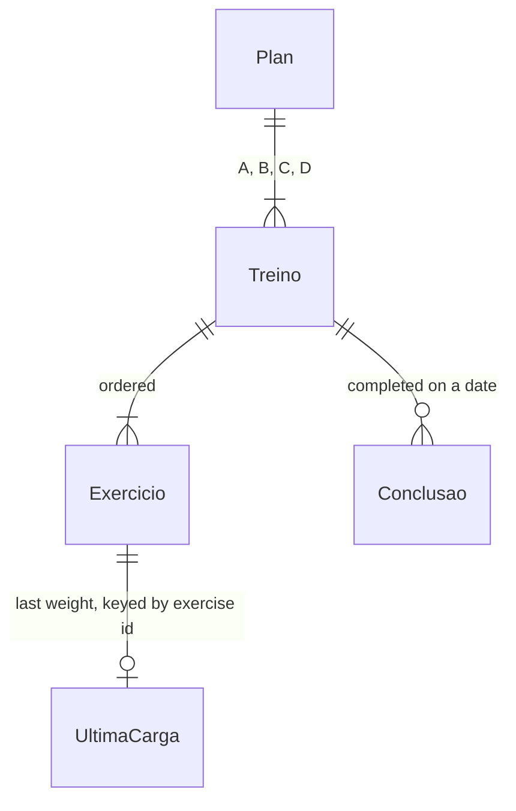

# Gym checklist app ("Treino Miudinha")

## Problem

Samuel's wife started at the gym with a 4-workout plan from her personal trainer
(`docs/exercices-list.md`, A–D, 6–9 exercises each). The plan is a text message. During the
workout she has to scroll it to find the right block, keep track in her head of which exercises
she has done and what weight she used last time, and nothing shows her that she is turning up
consistently. The source has no numbers. It is a two-week-old habit that one person relies on,
and the risk is that she quits, not a measured cost.

When this ships, she opens one icon on her phone and sees the next workout. She ticks off
exercises as she goes, with her last weight already filled in. Finishing a workout is
celebrated, and a weekly streak shows her consistency without a single missed day wiping it out.

## Flow

Greenfield: there is no code to reuse. The trainer's plan is reused by transcribing it into one
static data file. It is never parsed at runtime.

1. app shell loads `Plan` (door 2) - the 4 workouts with their exercises, sets and reps, compiled into the bundle
2. `Store` (door 1) reads `localStorage["treino:v1"]` - completions, today's checks, last weight per exercise, timer preference
3. `Rotation` (new, no door - placement per conventions) - from the completions and today's date, decides: the next workout, whether today is a rest day, and whether a workout was already completed today
4. screen `Hoje` renders that workout. Checking off exercises and entering weights writes back through `Store`. The last check appends a `Completion` and triggers the celebration
5. `Progress` (new, no door) - from the completions: this week N/4, the streak in weeks, and the Mon–Sun strip
6. out: a JSON file downloaded by `Backup` (door 3), and the same format read back on import

## Impact

| Front | What changes |
| --- | --- |
| domain | new term: `Treino` (workout) - one of A, B, C or D from the trainer's plan, lives in `Plan` |
| domain | new term: `Conclusão` (completion) - a workout that had every exercise checked off on a local calendar date, lives in `Store` |
| domain | new term: `Sequência` (streak) - consecutive Mon–Sun weeks, each with ≥3 completions, lives in `Progress` |
| stored data | nothing to migrate: no existing data. Every later change to the stored shape runs against her real history on one phone, so the record carries `version` from day one (door 1) |
| hosting | new Vercel project serving a static build. No server functions |

## Relations

One-way constraints: a `Conclusao` references a workout by its letter id (`A`–`D`), so the letters
stay stable even if the trainer changes a workout's content (door 2). There is at most one
`Conclusao` per workout per date (door 1). Last weight is keyed by an exercise id shared across
workouts (`abdominal-reto` appears in both B and D and has one weight).

## Surface

None. Nothing outside the app consumes it. The backup file is the only external format, and it
is covered as door 3.

## Landing

| One-way door | Literal shape | Alternative rejected |
| --- | --- | --- |
| 1. persisted record | one `localStorage` key `treino:v1` holding `{ version: 1, completions: [{ date: "YYYY-MM-DD", workout: "A" }], today: { date, workout, checked: [exerciseId] }, weights: { [exerciseId]: number }, restSeconds: 60 \| 90 }` | one key per concern - writes stop being atomic, and backup turns into a set of key-by-key reads |
| 2. plan identity | workouts are ids `A`–`D`, and exercises have stable slug ids (`leg-press-45`), in a typed data module | parse `exercices-list.md` at runtime - it is free text with en-dashes and `10–12` ranges, and a trainer's edit would silently break ids |
| 3. backup format | a downloaded `treino-backup-YYYY-MM-DD.json` whose content is exactly the door-1 record. Import validates `version === 1` and replaces everything after a confirm | copy/paste text - unreliable on iOS for long strings. Merging on import - can produce duplicate completions and has no use case with a single device |
| 4. stack | Vite + React + TypeScript, Tailwind CSS, `vite-plugin-pwa` (manifest + offline cache), Vitest + Testing Library | plain HTML/JS - the timer, the derived progress state and the tests all get harder for little saving. Next.js - SSR and routing nobody needs for a static single-screen app |
| 5. dates | local calendar date `YYYY-MM-DD` of the device. Weeks start on Monday | UTC timestamps - a workout at 22:00 in UTC-3 would land on the next day |

- Nothing else in this change is hard to reverse

## Criteria

### S1: Hoje - today's workout checklist (P1)

She opens the app and gets the right workout to tick off.

**Acceptance Criteria**

1. WHEN no completion exists THEN the system SHALL show Treino A on screen `Hoje`
2. WHEN the most recent completion is workout X THEN the system SHALL show the workout after X in the order A→B→C→D→A
3. The system SHALL show, for the shown workout, its letter, its focus (e.g. "perna, quadríceps") and every exercise in plan order with its sets×reps literal (e.g. `4×12`, `3×10–12`)
4. WHEN she taps an exercise THEN the system SHALL toggle it checked and update a progress indicator reading `checked/total`
5. WHEN the app is reloaded on the same local date THEN the system SHALL restore the checked exercises of the in-progress workout
6. WHEN the app opens on a later local date than the in-progress checks THEN the system SHALL discard those checks without recording a completion
7. WHEN the last unchecked exercise is checked THEN the system SHALL record a completion `{ date: today, workout }` and show a celebration with the text "Treino concluído!"
8. IF a completion for the same workout and date already exists THEN the system SHALL not record a second one
9. WHILE today has a completion the system SHALL show the completed state with "Próximo: Treino <next letter>"
10. WHILE the local weekday is Wednesday, Saturday or Sunday and today has no completion the system SHALL show "Hoje é descanso" with a button "Treinar mesmo assim" that reveals the next workout
11. WHEN she picks a workout from the A/B/C/D selector THEN the system SHALL show that workout for checking instead of the rotation's choice
12. WHERE the device prefers reduced motion the system SHALL show the celebration without animation

**Independent test:** with empty storage, tick every exercise of A. The completion is recorded, the celebration shows, and on reload the app shows "Próximo: Treino B".

### S2: Progresso - week and streak (P1)

She sees consistency, not perfection.

**Acceptance Criteria**

13. The system SHALL show "Esta semana: N/4", where N is the number of completions dated in the current Mon–Sun week
14. The system SHALL show the streak as the count of consecutive weeks with ≥3 completions, ending with last week, plus 1 if the current week already has ≥3
15. WHILE the current week has fewer than 3 completions the system SHALL not count it as breaking the streak
16. The system SHALL show a Mon–Sun strip for the current week, each day marked with the letter of any workout completed that date, today highlighted and future days dimmed
17. WHEN no completion exists THEN the system SHALL show streak 0 with the text "Comece hoje 💪"

**Independent test:** seed completions for 3 weeks (3, 4 and 2 workouts, the current week last). The app shows the streak as 2 and "Esta semana: 2/4".

### S3: Carga - last weight per exercise (P2)

**Acceptance Criteria**

18. The system SHALL offer a numeric weight field in kg per exercise, prefilled with the last saved value for that exercise id
19. WHEN she changes a weight THEN the system SHALL save it as that exercise's last weight
20. IF the entered weight is not a number between 0 and 500 THEN the system SHALL keep the previous value
21. The system SHALL allow an exercise to have no weight and show the field empty

**Independent test:** enter 40 on Leg press 45°, reload. The field shows 40.

### S4: Descanso - rest timer (P2)

**Acceptance Criteria**

22. WHEN she taps the timer button THEN the system SHALL count down from the chosen rest time (90 s by default, 60 s selectable)
23. WHEN the countdown reaches 0 THEN the system SHALL show a finished state and call `navigator.vibrate` where it exists
24. WHEN the app returns to the foreground during a countdown THEN the system SHALL show the remaining time computed from the end timestamp
25. WHEN she taps the running timer THEN the system SHALL cancel it

**Independent test:** start the timer, wait for 0, see the finished state.

### S5: Instalar - home screen and offline (P2)

**Acceptance Criteria**

26. The system SHALL serve a web manifest with name "Treino Miudinha", short name "Miudinha", standalone display, and 192 px and 512 px icons, plus an `apple-touch-icon`
27. WHILE the device is offline after one successful visit the system SHALL load and work fully

**Independent test:** a Lighthouse installability check passes. In airplane mode, the app loads from the home screen icon.

### S6: Backup - export and import (P3)

**Acceptance Criteria**

28. WHEN she taps "Exportar" THEN the system SHALL download `treino-backup-YYYY-MM-DD.json` containing the stored record
29. WHEN she picks a valid backup file and confirms THEN the system SHALL replace the stored record and re-render
30. IF the picked file is not JSON or lacks `version: 1` THEN the system SHALL show "Arquivo inválido" and leave the stored record unchanged
31. IF `localStorage` is unavailable or a write throws THEN the system SHALL keep working in memory and show "Seus dados não estão sendo salvos neste navegador"

**Independent test:** export, clear the site data, import. The streak is the same as before.

## Out of scope

| Excluded | Why |
| --- | --- |
| accounts, sync, backend | one user and one phone. Backup covers losing the phone |
| editing the plan in the app | the trainer changes it rarely. Edit the data file and redeploy |
| checking off individual sets | more tapping mid-workout, and it was rejected in discovery |
| history charts and weight progression graphs | not needed to see consistency. Revisit after a month of use |
| exercise images or videos | the trainer demonstrates them in person |
| notifications or reminders | needs push and a backend, which is out for v1 |

## Assumptions

| Assumption | Chosen default | Rationale | Confirmed? |
| --- | --- | --- | --- |
| a half-done workout left until the next day | its checks are discarded (AC 6) and the rotation stays on it | a session belongs to one day, and stale half-checks would be confusing a week later | y |
| UI language and units | Portuguese copy, weight in kg, step 0.5 | the trainer's plan is in Portuguese, and Brazilian gyms use kg | y |
| visual style | mobile-first single screen with a warm accent colour, large tap targets (≥48 px), and dark mode following the system setting | "simple, functional and pretty", used one-handed at the gym | y |
| repeated exercise across workouts | one shared weight (`abdominal-reto` in B and D) | it is the same movement | y |
| two different workouts in one day | both count, one completion each | rare, and refusing it would penalise effort | y |
| deploy | Vercel project from a git repo, static output. Samuel runs the first deploy | a deploy needs his account (blast radius rule) | y |

**Open questions:** none - all resolved or logged above.

## Observable

| Surface | Decision | Landing |
| --- | --- | --- |
| screen `Hoje` | empty state (first use) | AC 1, AC 17 |
| screen `Hoje` | loading state | n/a - data is bundled and storage reads are synchronous, so there is nothing to wait for |
| screen `Hoje` | error state | AC 31 |
| screen `Hoje` | unauthorised state | n/a - no accounts |
| screen `Hoje` | density and ordering | AC 3 - plan order, one row per exercise |
| screen `Hoje` | destructive action confirms | AC 4 - unchecking is a single tap and reversible, so no confirm |
| screen `Progresso` | empty state | AC 17 |
| screen `Progresso` | loading, error, unauthorised | n/a - derived from the in-memory record |
| screen `Backup` | destructive action confirms | AC 29 - import replaces everything only after a confirm |
| screen `Backup` | error state | AC 30 |
| backup file | structure | door 3 - the door-1 record verbatim |
| backup file | what the reader does next | AC 29 - import it on the new device |

## Sources

- `docs/exercices-list.md` - the trainer's plan: 4 workouts with their exercises, sets and reps
- discovery session 2026-10-06 - rotation, weekly streak, localStorage, feature scope (settled)
