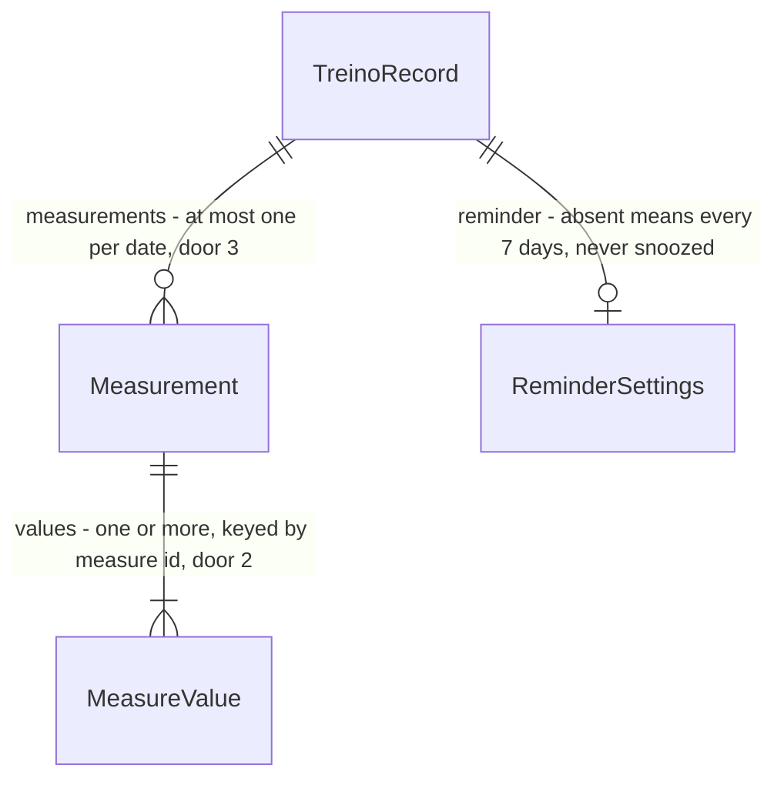

# Measurement

## Problem

She can't track her weight and body measurements in the app. The Excel sheet she used before her
break no longer exists, so there is no history and nothing to import. The first measurements
they take now become her baseline. Her whole workout history lives in one stored record on one
phone (`treino:v1`), and every change to that record's shape runs against her real data. A bad
shape, or a version bump that an older build rejects, can erase it (design, Key decision 2).

This slice is the first of seven in `.design/body-measurements.md`. It adds the stored
Measurements and reminder settings, the rules that keep them valid, and the backup round-trip.
Nothing changes on screen yet: Menu, Registrar medição, Lembrete, Histórico, Gráfico and
MeasureGuide are the next slices and build on this one. When it ships, a record can hold her
measurements, survive export and import, and survive being opened by the build that is on her
phone today.

## Flow

This reuses the existing single-key record (gym-app door 1), its parser, the `useRecord`
write-back and the `Backup` export/import unchanged. Nothing is stored beside the record, and no
second backup file is added.

1. app bundle ships `Measures` (door 2) - the 11 measure ids with unit and range, compiled in
2. `Store.parseRecord` (exists) reads `measurements` and `reminder` when present, dropping malformed entries and values. A record without them comes back without them
3. measurement operations (new, no door - placement per conventions) - save (new or merge, door 3), delete, and the last tape date. Each returns a new record or a refusal naming why
4. out: `useRecord` (exists) writes the record to `localStorage["treino:v1"]`, and `Backup` (exists) exports it verbatim and imports it through `Store.parseRecord`

## Impact

| Front | What changes |
| --- | --- |
| domain | new term: `Measurement` - one dated entry holding one or more of the 11 measures, lives in the stored record |
| domain | new term: measure id (`cintura`, `braco-d`) - the stable identity a value, a guide and a chart key on, lives in `Measures` |
| domain | existing term: `TreinoRecord` gains two optional fields, `measurements` and `reminder`. `parseRecord` and `freshRecord` branch on its shape. `store.test.ts` "persists the door-1 record" asserts the exact key list of a fresh record and must keep passing unchanged, because the new keys are absent until used |
| stored data | nothing to migrate: migrate on read. Absent fields mean no measurements and the default reminder, and nothing is written for them until a Measurement or a reminder change exists |
| older build | the build on her phone today (9e5a252) builds its record from known fields only, so it keeps her workouts and drops the measurements on its next save (design, Key decision 2) |
| backup | the file is still the record verbatim (gym-app door 3), so it carries the two fields when present. File name and import confirm unchanged. Old backups import as before |

## Relations

One-way constraints: at most one `Measurement` per date (door 3). Every value is keyed by one of
the 11 measure ids (door 2). Both fields are optional inside the record, which stays
`version: 1` under `treino:v1` (door 1). No columns and no types here.

## Surface

None - nothing consumed outside. The backup file is the record (gym-app door 3) and gains the two
fields described under Relations.

## Landing

| One-way door | Literal shape | Alternative rejected |
| --- | --- | --- |
| 1. stored shape - every later build reads it against her real history | `TreinoRecord` gains `measurements?: Measurement[]` and `reminder?: { everyDays: 7 \| 14 \| 30 \| null; snoozedOn: string \| null }`, with `Measurement = { date: "YYYY-MM-DD"; values: Partial<Record<MeasureId, number>> }`. `version` stays `1`, key stays `treino:v1`, `measurements` ordered by ascending date | `version: 2` - the build on her phone rejects it and writes a fresh record over it, erasing everything. A separate `medidas:v1` key - a second backup file and a second import, with no need to export or wipe measurements alone. Required fields written on load - rewrites her record on first open and changes the fresh record's key set |
| 2. measure ids and units | `peso` (kg), `busto`, `cintura`, `abdomen`, `quadril`, `braco-d`, `braco-e`, `coxa-d`, `coxa-e`, `panturrilha-d`, `panturrilha-e` (cm). Values are numbers with at most one decimal | labels as keys (`Abdômen`) - a wording fix would orphan her history. Strings with a pt-BR comma - range checks and the chart need numbers |
| 3. one Measurement per date, saving merges | saving onto a date that has an entry overwrites the given ids and keeps the others. Still one entry for that date | a list allowing several entries per date - a gym weigh-in and the home tape on one evening become two Histórico rows and two chart points |

- Nothing else in this change is hard to reverse. The operations and the parser's dropping rules are code a redeploy changes

## Criteria

### S1: Measurements live in her record and survive backup (P1)

The record holds dated Measurements and reminder settings, keeps them valid, and carries them
through export, import and the older build.

**Acceptance Criteria**

1. The system SHALL define exactly 11 measure ids with these units and inclusive ranges: `peso` kg 30–200, `busto` cm 50–160, `cintura` cm 40–150, `abdomen` cm 40–160, `quadril` cm 60–170, `braco-d` and `braco-e` cm 15–60, `coxa-d` and `coxa-e` cm 30–90, `panturrilha-d` and `panturrilha-e` cm 20–60
2. WHEN a stored record without `measurements` and `reminder` is loaded THEN the system SHALL report zero Measurements and the reminder `{ everyDays: 7, snoozedOn: null }`, and SHALL return `completions`, `today`, `weights` and `restSeconds` equal to the stored ones
3. WHEN a stored record without `measurements` and `reminder` is loaded and saved back THEN the stored JSON SHALL contain neither key
4. WHEN a Measurement is saved on a date that has none THEN the system SHALL add one entry with that date and exactly the given values, and `measurements` SHALL stay ordered by ascending date
5. WHEN a Measurement is saved on a date that already has one THEN the system SHALL keep one entry for that date whose values are the given ones plus the earlier values for every id not given
6. IF a save carries no values THEN the system SHALL refuse it and return the record unchanged
7. IF a save carries a value outside its measure's range, a value with more than one decimal, or a value that is not a finite number THEN the system SHALL refuse the whole save, return the record unchanged, and name every such measure id
8. IF a save's date is not a valid `YYYY-MM-DD` calendar date or is after today THEN the system SHALL refuse it and return the record unchanged
9. WHEN a Measurement is deleted by date THEN the system SHALL remove that entry and leave every other entry unchanged
10. The system SHALL report as the last tape date the latest date whose Measurement holds at least one measure other than `peso`, and none when no such Measurement exists
11. WHEN the Measurement on the last tape date is deleted THEN the system SHALL report the previous tape Measurement's date as the last tape date
12. The system SHALL store a record that holds Measurements under the key `treino:v1` with `version: 1`
13. WHEN a record with Measurements and reminder settings is exported and that file is imported on this build THEN the system SHALL restore the same `measurements` and `reminder`
14. WHEN a backup without `measurements` and `reminder` is imported THEN the system SHALL accept it and report zero Measurements and the default reminder
15. IF a stored or imported Measurement has an invalid date, `values` that is not an object, or no valid value left THEN the system SHALL drop that entry and keep the rest of the record
16. IF a stored or imported Measurement holds an unknown measure id or an invalid value (not a finite number, out of range, more than one decimal) THEN the system SHALL drop that value and keep the entry's valid values
17. IF a stored or imported record holds two Measurements on one date THEN the system SHALL keep one entry for that date, merged in file order with the later value winning per measure, and SHALL order the entries by ascending date
18. IF a stored or imported record has `measurements` that is not a list THEN the system SHALL treat it as zero Measurements and keep the rest of the record
19. IF a stored or imported `reminder.everyDays` is not 7, 14, 30 or `null` THEN the system SHALL use 7, and IF `reminder.snoozedOn` is not a valid `YYYY-MM-DD` date THEN the system SHALL use `null`
20. WHEN the parser of the build before this feature (`parseRecord` at 9e5a252) reads a record that holds Measurements THEN it SHALL accept the record with `completions`, `today`, `weights` and `restSeconds` unchanged

**Independent test:** `pnpm test` - the store and measurement unit tests, the Backup import test in
`App.test.tsx`, and the frozen 9e5a252 parser fixture. Nothing visible changes in the app.

## Out of scope

Product capabilities only. Process and harness rules live in AGENTS.md or as Observable `n/a`.

| Excluded | Why |
| --- | --- |
| The Registrar medição form, typed-text parsing with a pt-BR comma, "Confira este valor" | slice Registrar medição |
| Setting the interval, "Hoje não", and the reminder card | slice Lembrete. This slice stores and parses `reminder` only |
| Editing an entry where a cleared field removes the measure | slice Histórico. Its replace semantics differ from the merge here |
| Menu, Gráfico, MeasureGuide | their own slices in the design |
| Goals, body fat %, photos, notifications, sync | out of the design's boundary |

## Assumptions

Defaults that are not already a numbered criterion. Drop a row once it is.

| Assumption | Chosen default | Rationale | Confirmed? |
| --- | --- | --- | --- |
| A stored or imported Measurement dated after today | kept as it is | the importer has no "today" to check against, and the only way to get one is a wrong phone clock. The form's date picker stops new ones (slice Registrar medição) | y - Samuel took the recommended default, 2026-10-08 |
| How "at most one decimal" is checked for a stored number | the value times 10 is within 1e-9 of a whole number | `62.9 * 10` is not exactly 629 in floating point, so an exact check would refuse real values | n |

**Open questions:** none - all resolved or logged above.

## Observable

Worksheet, not the review. `n/a` needs its reason. One row may group the same decision
across several routes.

| Surface | Decision | Landing |
| --- | --- | --- |
| screens | empty, loading, error states, ordering, destructive confirm | n/a - this slice adds no screen. Each later slice carries its own |
| backup file | structure | existing - gym-app door 3, the record verbatim, now with AC 13 |
| backup file | an older file without the new fields | AC 14 |
| backup file | a file with a malformed Measurement | AC 15, AC 16, AC 17, AC 18, AC 19 |
| backup file | what the reader does next | existing - the import confirm "Substituir todos os dados deste aparelho pelos do backup?" is unchanged |
| collection `measurements` | ordering | AC 4, AC 17 |
| collection `measurements` | duplicates | AC 5, AC 17 |
| collection `measurements` | grouping and naming | AC 1 - fixed measure ids, labels come with the form |
| collection `measurements` | the exception that does not fit | AC 10 - a weight-only entry is valid and is not a tape Measurement |

## Sources

- `.design/body-measurements.md`, slice Measurement and Key decisions 2, 3, 4, 6 - confirmed by Samuel 2026-10-08
- `.specs/features/gym-app/plan.md` - doors 1 (versioned single-key record), 2 (stable ids), 3 (backup is the record verbatim), 5 (local dates)
